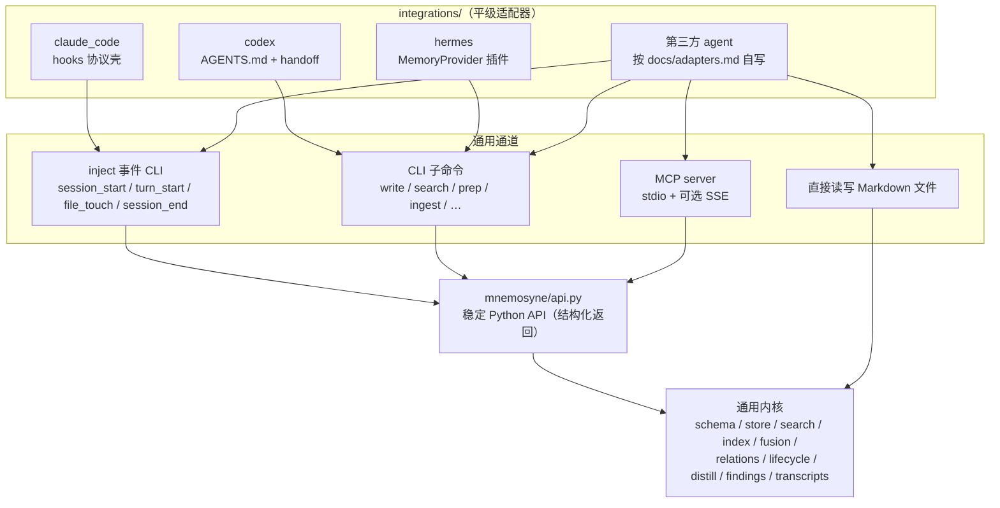

# Mnemosyne 通用化设计：通用内核 + 适配器架构

日期：2026-07-26
状态：已批准（用户确认方案 B；开放问题已裁决，见第 9 节）
关联决策：`arch_decision-2026-07-26-ce46b30a`（用户指示：定位为所有 agent 通用的记忆系统）

## 1. 背景与目标

Mnemosyne 当前的叙事和接入层绑定三个具名 agent（Claude Code、Codex、Hermes），
但核心模块（schema / store / search / tokenizer / index / fusion / relations /
graph / lifecycle / eval / distill 分类内核）已经是 agent 无关的。2026 年同类项目
调研（Mem0、Letta、Zep/Graphiti、cognee、LangMem、memobase、basic-memory、
mcp-memory-service、claude-mem）确认三条行业共识：

1. MCP 是跨 agent 记忆接入的事实标准；工具面要窄。
2. 生命周期 hooks 的确定性注入是对纯 MCP 被动模式的稀缺差异化，且各家
   hooks 事件模型（SessionStart / UserPromptSubmit / PreToolUse / Stop）已趋同。
3. 重基础设施是该赛道头号死因；Markdown + SQLite + stdlib-only 是护城河。

**目标**：把接入层重构为「通用内核 + 平级适配器」，使任何 agent 通过
MCP / CLI / 注入事件 / 直接读写文件四条路径低成本接入；Claude Code、Codex、
Hermes 降级为三个官方适配器示例。全程保持向后兼容与存储格式不变。

## 2. 非目标

- 不做 REST HTTP API、不做长驻 daemon（现有 MCP SSE 维持调试定位）。
- 不做 LangGraph / CrewAI / AutoGen 等框架 SDK 适配器。
- 不引入任何新的重依赖（数据库、向量服务、Web UI）；核心仍为 stdlib + portalocker。
- 不改动记忆文件格式与 store 目录布局（「你的记忆文件永远可读」是对外承诺）。

## 3. 架构总览

原则：**所有通道共享同一 API 与存储，杜绝多份互相漂移的记忆**；写路径靠
hooks/事件（确定性蒸馏）+ MCP（主动补充），读路径三层兜底（事件注入 >
MCP 按需检索 > 引导文件静态核心记忆）。

## 4. 组件设计

### 4.1 稳定 Python API 门面（`mnemosyne/api.py`）

新增 `mnemosyne/api.py`，导出一小组带兼容承诺的函数，返回 dataclass 而非
打印文本：

- `write_memory(...) -> WriteResult`（`status: created|duplicate`、`id`、`path`、
  `duplicate_of`）
- `search(...) -> list[SearchHit]`（沿用 `search --format json` 现有字段：
  `why_matched`、`score_breakdown` 等）
- `read_core() / show(id) / link(a, b, rel) / graph(id, ...)`
- `prep_context(task, ...) -> str`、`ingest_findings(text, ...) -> IngestResult`
- `distill(text | transcript, ...) -> DistillResult`

CLI 的 `cmd_*` 与 MCP handler 全部改为消费 api.py（`cmd_*` 只负责参数解析与
人类可读输出）。`mnemosyne/__init__.py` 导出 api 符号；CHANGELOG 声明其为
公共 API 并承诺兼容性。这同时根治 `mcp/server.py` 目前用 `redirect_stdout`
捕获并按 `"Wrote "` / `"Duplicate of "` 前缀解析 CLI 文案的脆弱耦合。

### 4.2 通用注入事件接口（`mnemosyne inject`）

定义四个 agent 无关的注入事件，作为自动注入能力的中立协议：

| 事件 | 语义 | 现对应 Claude Code hook |
|---|---|---|
| `session_start` | 会话开始，注入 core + 高强度记忆 | SessionStart |
| `turn_start` | 用户输入一轮 prompt，按关键词注入相关记忆 | UserPromptSubmit |
| `file_touch` | 即将改动某些文件，按路径注入相关记忆 | PreToolUse(Edit/Write) |
| `session_end` | 会话结束，触发蒸馏 | Stop |

新增 CLI：`mnemosyne inject --event <name> [--session ID] [--format text|json] [--fail-safe]`，
从 stdin 读标准化 JSON 事件（如 `{"prompt": ...}`、`{"files": [...]}`、
`{"transcript": {"path": ..., "format": ...}}`），输出注入上下文
（json 模式含 `context / memory_ids / approx_tokens`）。

配套重构：把 `hooks/_common.py` 中与 Claude 协议无关的通用逻辑上移——
`extract_keywords / run_search / format_for_injection` 移入 `mnemosyne/injection.py`，
`.session_injected.json` 会话去重移入 `mnemosyne/session_state.py`（session key
由调用方任意提供；无 session 时的降级行为文档化）。注入尾注不再硬编码
`python3 -m mnemosyne show <id>`：模板进 config（`[injection] show_command_template`），
并按通道感知（CLI 提示 shell 命令 / MCP 提示 `mnemosyne_show` 工具 / 可关闭）。

### 4.3 适配器框架（`integrations/` + `mnemosyne install <agent>`)

- `mnemosyne/hooks/` 整体迁入 `integrations/claude_code/`，只保留「Claude Code
  hook JSON ↔ 通用事件」的协议壳（stdin 解析、`hookSpecificOutput` 输出、
  `hook_safe` 兜底）。`mnemosyne.hooks.*` 模块路径保留为兼容 shim（用户的
  `settings.json` 引用了这些入口，不能断）。
- `pre_tool_use` 不再硬编码 `('Edit', 'Write')`：工具名列表进 config
  （`[hooks] write_tools`），并支持按 `tool_input` 中的 file_path 类字段兜底匹配。
- Hermes 适配器中的 subprocess CLI 桥接逻辑抽为 `integrations/_bridge.py` 的
  通用 `CLIBridge`，供未来宿主进程内插件复用；工具描述改中立措辞；
  `/opt/homebrew/bin/python3` 等候选路径改为可配置列表。
- 新增 `mnemosyne install <agent>` 统一安装入口（`install hermes` 迁移现有逻辑，
  `install claude-code` 落地 hooks 配置与模板；`install-hermes` 保留为 alias）。
- 新增 `docs/adapters.md`：适配器契约规范（四事件映射表、transcript 供给、
  安装约定、错误约定），Hermes 与 claude_code 作为参考实现。
- 新增 `tests/test_adapter_contract.py` 契约测试套件：注入产出、findings 往返、
  蒸馏幂等、并发写安全；新适配器跑通即视为合规。

### 4.4 中立交接格式（`handoff.py` + findings spec）

- `codex.py` 改名 `mnemosyne/handoff.py`；`mnemosyne/codex.py` 保留为
  re-export shim。`Finding` dataclass 移入中立的 `mnemosyne/findings.py`，
  `handoff` 与 `distill` 共同依赖它，消除 `distill → codex` 反向依赖。
- 交接块格式升格为有版本号的正式规范 `docs/handoff-format.md`（v1 =
  现行 `**新发现:**` / `**Findings:**` Markdown 块），并新增 JSON 变体
  （`{"findings": [{type, title, content, importance, tags, scope}]}`），
  `ingest --format markdown|json|auto`。
- `parse_findings` 的类型校验改为从 `load_config()` 的 `memory.types` 派生，
  硬编码 `ALLOWED_TYPES` 仅作无配置回退（修复：用户自定义类型可手动 write
  却被 ingest/distill 静默丢弃的不一致）。
- `prep()` 的检索提示按通道参数化（shell 命令 / MCP 工具 / 无提示），统一
  两处不一致的 `python -m` / `python3 -m` 模板。

### 4.5 transcript 解析器注册表（`mnemosyne/transcripts.py`）

解析器注册表 + 自动检测，`distill --transcript` 增加 `--format`：

- `claude-jsonl`：现有 `parse_claude_transcript` 迁入；
- `role-jsonl`：每行 `{"role": ..., "text": ...}` 的中立格式，作为第一公民
  文档化（任何 agent 的会话记录预处理成它即可走完整蒸馏管线）；
- `text`：现有纯文本 / `[role] text` 行为。

`distill --source` 默认值由 `'claude-code'` 改为中立的 `'agent'`；增量蒸馏
状态 key 抽象为 `(source, transcript_key)`。

### 4.6 记忆类型单一事实来源

类型枚举一律从 config `memory.types` 派生：`parse_findings` 校验、
`distill/llm.py` 提示词枚举、模板渲染。类型元数据（importance 区间、写入
触发条件描述）进 config 可选表（`[memory.type_meta]`），供各适配器生成
引导文案，消除双轨。

### 4.7 MCP server 整改

- 工具 `mnemosyne_codex_prep` 改名 `mnemosyne_prep_context`，旧名保留 alias
  至少一个 minor 版本；其余工具名不动（避免破坏既有客户端配置）。
- `_write / _maintain / _link` 改调 api.py，删除 `redirect_stdout` + 文案解析。
- 删除人为的 MCP SDK 存在性检查（实现本就是纯 stdlib JSON-RPC，从不 import
  SDK）：stdlib 实现直接可用，`MNEMOSYNE_MCP_ALLOW_STDLIB` 逃生舱与 README
  中 `mnemosyne[mcp]` 前置要求一并移除。
- 工具描述改中立措辞，并补充 MCP 行为注解（`readOnlyHint` /
  `destructiveHint` / `idempotentHint`，借鉴 basic-memory）。
- 新增文档：「纯 MCP 接入即可获得的能力」指南（read_core + search 组合出
  与 hooks 注入近似的会话开场用法）。

### 4.8 CLI 命令面

- `codex-prep` / `codex-ingest` → 通用 `prep` / `ingest`（旧名保留 alias）。
- `install-hermes` → `install <agent>`（见 4.3）。
- `init` 增加 `--agent <name>`：按所选 agent 落地对应模板与 Next steps 文案。
  零参数 `init` 默认写一份 agent 无关的 generic `AGENTS.md`（AGENTS.md 是
  20+ 工具通读的行业标准文件名，但内容改为中立的记忆使用协议，不再是
  Codex 专属措辞）；`--no-agent-files` 可跳过。
- `distill` 帮助文案去除「Claude Code JSONL」措辞（改为列支持的格式）。
- `source` 字段定命名规范 `<agent>[:<profile>]`，write 入口归一化，README
  文档化保留值；为未来 `search --source` 过滤留口。

### 4.9 文档与模板重定位

- 模板按 agent 分目录：`templates/agents/claude_code/`（CLAUDE.md、
  settings.json）、`templates/agents/codex/`（AGENTS.md）、
  `templates/agents/generic/`（agent 无关的 system prompt 片段）；
  `templates/mcp_clients/` 维持。
- README 叙事重写：首段定位「本地优先的通用 agent 记忆内核」，新增
  「接入任意 agent」章节，分别给出 MCP（一条命令）、CLI、直接读写文件三条
  路径的最小步骤；Claude Code / Codex / Hermes 改述为「官方适配器」。
- 双语：README 反转为英文主体（`README.md` 英文，利于 GitHub 传播），
  中文版迁为 `README.zh.md`，互相链接。
- 语言无关接口规范集中成 `docs/interface.md`：frontmatter 字段说明（含手写
  YAML 解析器支持的子集）、`search --format json` 输出 schema、findings
  grammar 引用、config.toml 键表。
- `pyproject.toml` keywords 调整（`agent-memory`、`mcp` 等，`claude-code`
  降为其一）。

### 4.10 PyPI 发布（已暂缓）

用户裁决（2026-07-26）：暂不处理 PyPI 发布。`mnemosyne` 包名在 PyPI 已被
占用，未来发布需以别名（如 `mnemosyne-memory`）另行立项。本次交付不含 P5。

## 5. 兼容性策略

| 旧表面 | 新表面 | 处理 |
|---|---|---|
| `codex-prep` / `codex-ingest` | `prep` / `ingest` | alias 长期保留 |
| `install-hermes` | `install hermes` | alias 长期保留 |
| `mnemosyne.hooks.*` 模块入口 | `integrations/claude_code/` | import shim 长期保留（用户 settings.json 引用） |
| `mnemosyne.codex` 模块 | `mnemosyne.handoff` + `mnemosyne.findings` | re-export shim ≥ 一个 minor 周期 |
| MCP 工具 `mnemosyne_codex_prep` | `mnemosyne_prep_context` | 双注册 ≥ 一个 minor 周期 |
| `**新发现:**` Markdown 交接块 | 同左（v1 spec）+ JSON 变体 | 永久支持 |
| 存储格式 / store 布局 | 不变 | 承诺不破坏 |

弃用提示只打 stderr 警告，不阻断；hooks shim 静默（不能污染注入输出）。

## 6. 错误处理

- 适配器路径维持 fail-safe 传统：`inject --fail-safe`（适配器壳默认开）任何
  错误 exit 0 + 空输出，不拖垮宿主会话。
- api.py 抛类型化异常（`MnemosyneError` 层级）；CLI 转人类可读信息，
  MCP 转 JSON-RPC error。

## 7. 测试策略

- 适配器契约套件（4.3）跑 claude_code 与 hermes 两个参考实现。
- findings 往返测试：markdown v1 与 JSON 变体互转、自定义类型经 config 生效。
- transcript fixtures：三种格式 + 自动检测。
- 注入 golden 测试：四事件在固定语料上的输出快照（含 token 预算与去重）。
- 兼容性测试：旧命令 alias、旧模块 import、MCP 旧工具名全部可用。
- 现有测试与 CI recall@5 门槛保持绿色。

## 8. 分阶段交付（每阶段可独立发布）

1. **P1 内核**：`findings.py` + `api.py` + MCP 整改（去 stdout 解析、去 SDK
   门槛、`prep_context` 改名）。
2. **P2 注入**：`injection.py` / `session_state.py` 上移 + `inject` CLI +
   hooks 迁入 `integrations/claude_code/`（留 shim）。
3. **P3 交换**：`handoff.py` + JSON findings + transcript 注册表 + 类型统一。
4. **P4 表面**：CLI `prep/ingest/install` + `init --agent` + 模板重排 +
   README/文档重写（英文为主 + `README.zh.md`）+ `docs/adapters.md`、
   `docs/interface.md`。
5. ~~P5 发布~~：已暂缓（见 4.10）。

## 9. 开放问题（已全部裁决，2026-07-26）

1. **PyPI 包名**：暂缓，本次不做（用户裁决）。
2. **README 双语形式**：英文为主 `README.md` + 中文 `README.zh.md`（用户裁决）。
3. **`init` 默认引导文件**：零参数 `init` 写 generic 中立 `AGENTS.md`，
   `--agent` 叠加特定模板，`--no-agent-files` 跳过（实施方裁决）。
